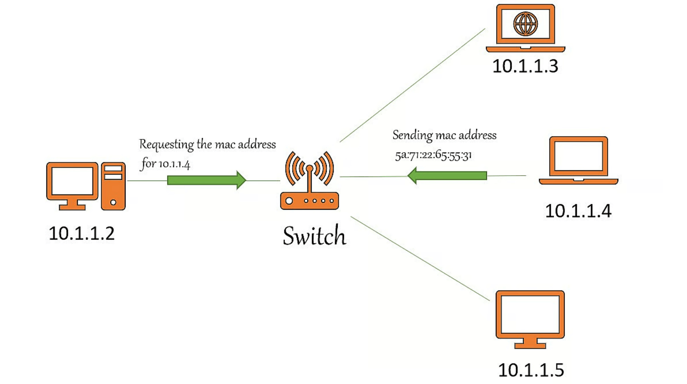
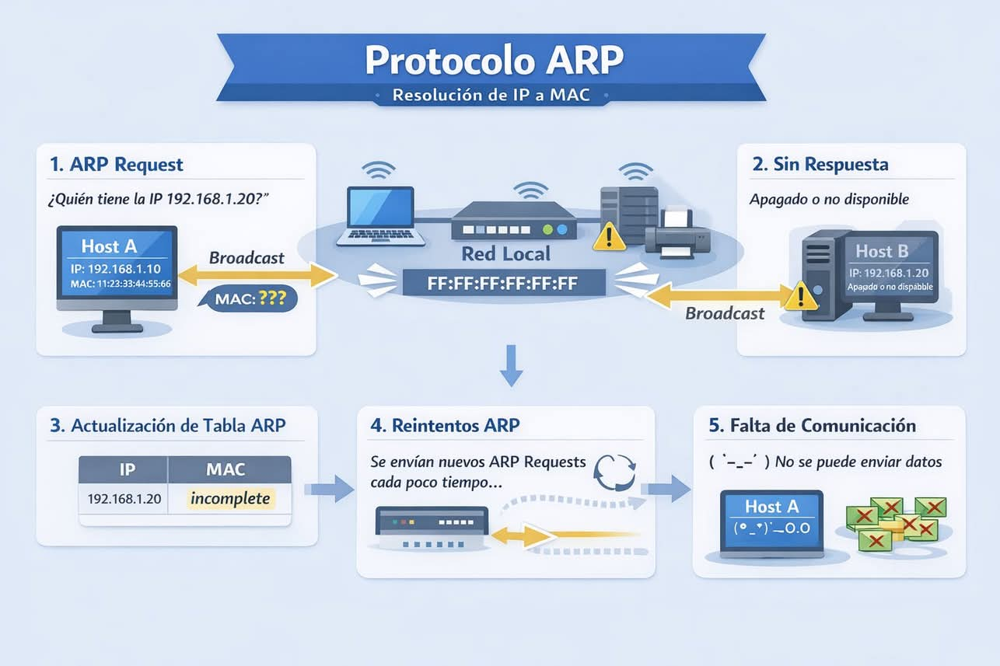

## Cómo comprobar y borrar la caché ARP en Windows, Linux y Mac


## ¿Qué es la caché ARP?

[ARP](https://www.fortinet.com/resources/cyberglossary/what-is-arp) significa Protocolo de resolución de direcciones, que **es responsable de descubrir direcciones MAC y asignarlas a Direcciones IP** para poder comunicarte con éxito con otros sistemas en la red local. Este protocolo funciona entre la capa de enlace de datos y la capa de red.



En lugar de preguntarle al enrutador cada vez dónde está ubicado el dispositivo en particular y cuál es su dirección MAC, nuestro sistema simplemente se conectaría usando las direcciones IP resueltas previamente.

Cuando nuestros sistemas encuentren las direcciones MAC para la dirección IP particular usando el protocolo ARP, se almacenarán en una tabla para uso futuro. Esta tabla se llama **caché ARP**. *Contiene una lista de direcciones IP conocidas y sus direcciones MAC*.

La solicitud ARP es una *transmisión* y la respuesta ARP es *unidifusión*.




## Cuando borrar la caché ARP

Si las **direcciones IP de los dispositivos vinculados a la red cambian**, las entradas ARP pueden dañarse o caducar, y es posible que las nuevas entradas no siempre anulen las entradas caducadas de la base de datos.

Como resultado, puede afectar al rendimiento de la red y puede causar problemas de carga o conectividad. En este caso, simplemente puede borrar el caché ARP para resolverlo. El borrar el caché de ARP hará que todas sus solicitudes pasen por todo el proceso ARP de nuevo. Durante esto proceso, las nuevas entradas se guardarán en la tabla ARP.

Es posible que se produzcan algunos errores durante la reconstrucción de la tabla de caché ARP, por lo que no se recomienda eliminar la caché ARP todo el tiempo. En su lugar, también puede reiniciar su enrutador o sistema para resolver los problemas de conectividad.

 

## ¿Cómo borrar la caché ARP?

Podemos borrar fácilmente la caché ARP en cualquier sistema operativo usando la consola de comandos o equivalente.

### Windows

**Paso 1**: Abra un símbolo del sistema y ejecútelo como administrador.

**Paso 2**: Para ver la tabla de caché ARP, simplemente escriba el siguiente comando.

```arp -a```


Este comando muestra las direcciones IP y está asociadoated direcciones mac.

**Paso 3**: A continuación, para eliminar la tabla de caché, puede utilizar la utilidad netsh.

```netsh interface IP delete arpcache```


o simplemente puede usar

```arp -d```


**Paso 4**: Si desea eliminar cualquier entrada específica en la caché, no toda la tabla.

```arp -d <ip-address>```


Muestra de salida:

```
C:\WINDOWS\system32>arp -a

Interface: 192.168.29.64 --- 0xd
  Internet Address      Physical Address      Type
  192.168.29.1          a8-da-0c-e8-0e-e6     dynamic
  224.0.0.22            01-00-5e-00-00-16     static
  224.0.0.251           01-00-5e-00-00-fb     static
  224.0.0.252           01-00-5e-00-00-fc     static

Interface: 192.168.56.1 --- 0x14
  Internet Address      Physical Address      Type
  224.0.0.22            01-00-5e-00-00-16     static
  224.0.0.251           01-00-5e-00-00-fb     static
  239.255.255.250       01-00-5e-7f-ff-fa     static

C:\WINDOWS\system32>netsh interface IP delete arpcache
Ok.
```


 

Obtendrá 'OK' como respuesta si usa la utilidad netsh para borrar la tabla de caché.

 

### Linux

**Paso 1**: Abra una terminal y use el siguiente comando de la utilidad IP para borrar toda la tabla ARP.

```ip -s -s neigh flush all```


**Paso 2**: Si desea eliminar el registro ARP para una dirección en particular, use la utilidad arp.

```arp -d <ip-address>```


**Paso 3**: Después de eliminar las entradas, simplemente puede usar el siguiente comando para ver la tabla ARP en Linux.

```arp -n```


Este comando muestra toda la tabla arp.

Muestra de salida:

```
┌──(root💀kali)-[/home/geekflare]
└─# arp -d 10.0.2.1

┌──(root💀kali)-[/home/geekflare]
└─# arp -n
Address          HWtype         HWaddress           Flags Mask        Interface

10.0.2.1                       (incomplete)

10.0.2.2         ether       01:00:5e:00:00:fc         C                 eth0
10.0.2.3         ether       a8:da:0c:e8:0e:e6         C                 eth0
```
 

Aquí, puede observar que se borra la entrada de caché para la dirección específica.

 

### Mac

**Paso 1**: Abra una terminal en tu mac y usa los siguientes comandos.

**Paso 2**: Para ver las entradas ARP existentes.

```sudo arp -a```


**Paso 3**: Para eliminar la caché de una interfaz en particular

```sudo arp -d 192.168.29.1 ifscope en0 ```


**Paso 4**: Para borrar toda la tabla de caché

```sudo arp -a -d```


Muestra de salida:

```shell
$ sudo arp -a

? (192.168.29.1) at 01:00:5e:00:00:fc on en0 ifscope [ethernet]
? (192.168.2.13) at a8:da:0c:e8:0e:e6 on en0 ifscope [ethernet]
? (192.168.1.21) at 01:00:5e:00:0e:16 on en0 ifscope permanent [ethernet]

$ sudo arp -a -d

192.168.29.1 (192.168.29.1) deleted
192.168.2.13 (192.168.2.13) deleted
192.168.1.21 (192.168.1.21) deleted
```
 

## Conclusión

Si no puede hacer ping a una dirección IP en particular en la misma red a pesar de que funcionan correctamente, es una señal de que algo anda mal. Es posible que deba reconstruir su tabla de caché ARP nuevamente.


???+ note "Pregunta"

    ¿Qué sistema operativo está modificando las reglas de su
    cortafuegos para que bloquee por defecto todas las conexiones ICMP?

    ??? question "Ver la respuesta"

        Windows Server 2025 y Windows 11
