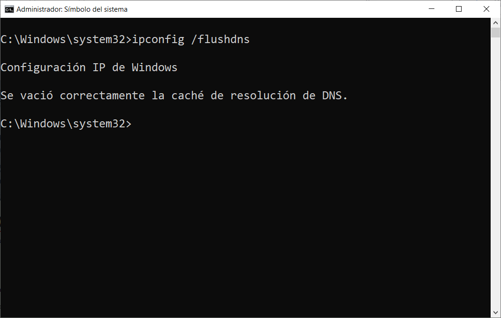
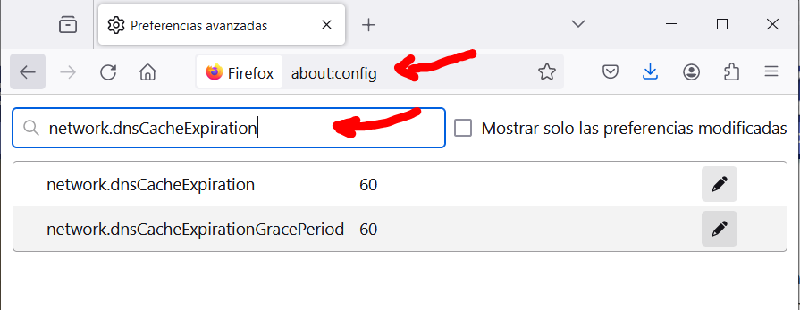
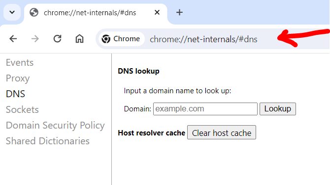
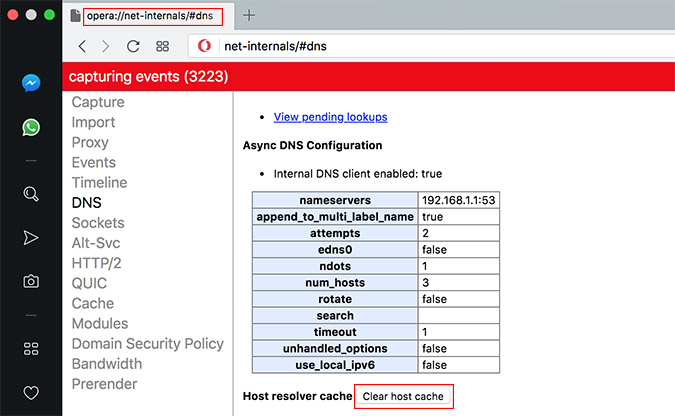
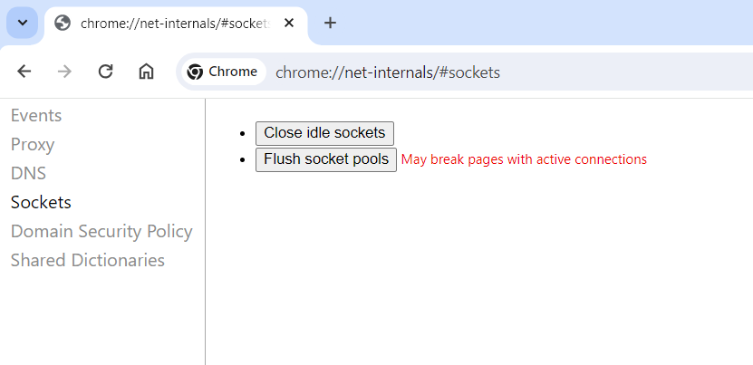
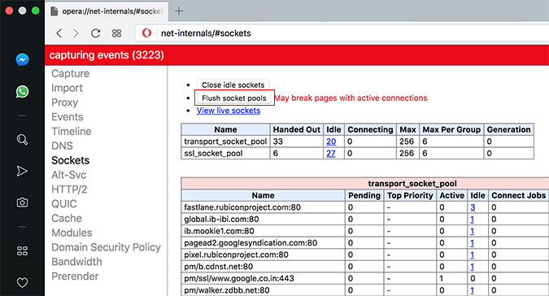

## DNS flush: vaciar la caché del DNS

Los sistemas operativos como Windows almacenan en la caché del DNS entradas temporales sobre todas las páginas web visitadas. En cuanto a la información, solo es válida durante un periodo de tiempo determinado. Un DNS flush, es decir el vaciado de la caché, elimina los datos del sistema antes del tiempo límite.

 

## ¿Qué es el DNS flush?

El procedimiento de eliminar manualmente las entradas temporales de la caché de DNS se denomina DNS flush. Sin esta intervención directa, las entradas existirían hasta que el tiempo de vida predeterminado (“Time to live”, TTL) terminase.

En cuanto al proceso de borrado, suele completarse mediante las herramientas que se encuentran en las líneas de comandos específicas del sistema: en los dispositivos Mac, por ejemplo, debes utilizar el terminal y el comando apropiado para la versión respectiva del sistema Apple. Si utilizas Windows, puedes realizar el DNS flush a través de CMD, el símbolo del sistema junto al comando “ipconfig /flushdns”.

 

## ¿Qué es la caché del DNS?

Para que los nombres de dominio como `www.ejemplo.com` se conviertan en *direcciones numéricas* se necesitan los llamados [servidores DNS](https://www.ionos.es/digitalguide/servidores/know-how/que-es-el-servidor-dns-y-como-funciona/). Por defecto, estos “servidores de nombres· entran en juego cada vez que el usuario intenta acceder a una página web a través de un ordenador. En caso de un gran número de visitantes, puede darse una sobrecarga del servidor y provocar el recurrente error "[el servidor DNS no responde](https://www.ionos.es/digitalguide/servidores/know-how/que-hacer-cuando-el-servidor-dns-no-responde/)”.

Por esta razón, los sistemas operativos como Windows y macOS dependen de su propia caché para interpretar las direcciones, la llamada caché del DNS, que almacena toda la información relevante para la resolución de nombres como la dirección IP, el nombre de host o la versión del protocolo. Si bien cada entrada es válida durante cierto período de tiempo. Dentro de este rango, las peticiones se responden directamente desde la caché sin tener que pasar por el servidor DNS.

!!! note "Nota:"
    Algunas aplicaciones como los navegadores web y los servidores de los proveedores de Internet también tienen su propia caché del DNS para acelerar la resolución de las direcciones.

 

## ¿Por qué es recomendable realizar un DNS flush de forma regular?

Hay tres razones en particular para poner a cero de forma regular el registro del DNS mediante una limpieza, independientemente del período real de validez de las entradas individuales:

1. **Para ocultar el comportamiento de navegación**: las direcciones listadas, incluyendo información adicional como el período de validez, ofrecen una visión general aproximada de las páginas web visitadas. Cuanto más amplio sea el almacenamiento de direcciones en la caché, más información estará disponible.
2. **Como medida de seguridad contra ataques de terceros**: si los ciberdelincuentes obtienen acceso a la caché del DNS, pueden manipular las entradas y, por ejemplo, redirigirlas a páginas web maliciosas. Este ataque, conocido como DNS spoofing, se utiliza para acceder a datos de inicio de sesión confidenciales, por ejemplo, en la banca online.
3. **Para resolver problemas técnicos**: el DNS flush puede eliminar problemas técnicos al abrir aplicaciones web. Por ejemplo, es posible que, debido a entradas obsoletas, se muestre una versión incorrecta de la página web visitada. Después del flush, la petición se dirige nuevamente al servidor DNS apropiado para recibir una respuesta y la conexión a la página web vuelve a funcionar de forma correcta.

!!! tip "Consejo:"
    Puedes ver la caché del DNS actualmente almacenada en tu sistema en cualquier momento. En Windows, abre la línea de comandos, como con el flush DNS CMD, e introduce el comando `ipconfig /displaydns`.


## Limpiar la caché del DNS: así funciona

No hay ninguna regla que determine el momento perfecto para vaciar la caché del DNS, a menos que haya un problema técnico importante que pueda resolverse haciendo un vaciado de la caché. Si decides borrar la caché del DNS, el proceso es rápido y sencillo. Los ***usuarios de Windows*** pueden, por ejemplo, hacerlo de la siguiente manera:

**Paso 1. Abrir la línea de comandos**

En primer lugar, utiliza la combinación de teclas [Windows] + [R] para abrir el diálogo “Ejecutar”. A continuación, ejecuta el comando `cmd` para iniciar el sistema.

**Paso 2. Flush DNS con “ipconfig /flushdns”**

Utiliza las opciones del comando ipconfig en la línea de comandos para realizar el DNS flush a través del CMD. Ahora solo debes introducir el siguiente comando y confirmarlo con “Enter”:

```bat
ipconfig /flushdns
```

Después de ejecutar el comando con éxito, recibirás un mensaje que te informará sobre el vaciado de la caché DNS de resolución.




!!! note "Nota:"
    No tienes que preocuparte de que un flush DNS tenga un efecto negativo a la hora de navegar por la red: solo el primer acceso a una página web después de restablecer la caché debería durar un poco más de lo normal.

 

## Rendimiento del equipo

Como puedes ver, **la caché DNS es una función que se utiliza para mejorar las velocidades de navegación por Internet**. Al acceder a los sitios web, el servidor resuelve el nombre del dominio en dirección IP. Esta es la información que se guarda en nuestro equipo. En todo caso, a pesar de que su función es mejorar el servicio y rendimiento, puede tener consecuencias negativas en algunos casos. Cuando pasa mucho tiempo donde navegamos por Internet sin limpiarla, el efecto puede ser totalmente, al contrario.

A medida que se utiliza el equipo, **la caché DNS se llena de información**. En estos casos mucha será información válida, pero otra mucha **puede estar totalmente obsoleta**. Esto tiene algunas consecuencias negativas en el equipo, en el rendimiento que obtenemos cuando navegamos por Internet. Por eso se recomienda realizar limpiezas periódicas. Cuando esta información es eliminada, hacemos que el servidor DNS tenga que realizar de nuevo la resolución de nombres de dominio. Por lo cual, se mejorará la calidad de la navegación. Pero no solo afecta a esto, sino que al ordenador en sí también.

Todo lo que este equipo contiene, consume recursos. Y como tal este consumo, aumentará poco a poco con el paso del tiempo si no se realiza algún tipo de mantenimiento como es el caso. Cuando esto ocurre, otras herramientas importantes pueden ver que su espació en el reparto de recursos es más pequeño. Por lo cual afectará de forma negativa a esta distribución, haciendo que algunas aplicaciones puedan funcionar más lentas, o que el equipo en sí se ralentice. En todo caso, esto es algo que no suele ocurrir a corto plazo. Estamos ante una memoria que guarda información con muy poco peso, por lo cual se suele tardar bastante en ver que puede ser un problema.

 

## Cómo limpiar la caché DNS

Para limpiar la caché DNS, es recomendable no solo hacerlo en el propio sistema operativo, sino también en los navegadores web que estemos utilizando, como Chrome o Firefox. Esto debemos tenerlo en cuenta ya que los navegadores también almacenan información en caché para no tener que preguntar continuamente al sistema operativo si tiene una resolución de nombres de dominio en caché. Son procesos diferentes.

De no realizarse esté procedimiento, estas estarían en nuestro equipo hasta que el tiempo de vida predeterminado de las mismas termine (TTL "Time To Live").

### Pasos para borrarla en Windows 11

También puedes borrar la caché DNS en Windows 11, el último sistema operativo de Microsoft. El proceso es muy similar y para ello tienes que ir a Inicio, entras en Terminal (aunque también puedes desde el Símbolo del sistema) y allí ejecutas el comando ipconfig /flushdns. Simplemente esperas a que aparezca el mensaje indicando que se ha vaciado correctamente la caché de resolución de DNS.

Es un proceso rápido y sencillo, pero que podría ayudarte a solucionar ciertos problemas que aparezcan. Resetearás la caché DNS y comenzará a registrarla desde cero, por lo que borrará cualquier posible conflicto que haya podido aparecer. Para asegurarte de que todo ha ido bien, siempre que ejecutes este tipo de comandos es conveniente reiniciar el equipo.

Una vez vuelvas a encender Windows 11, podrás acceder al navegador y comprobar si vuelve a funcionar con normalidad ese sitio web donde tenías problemas. Si era un fallo de la caché DNS, con total seguridad podrás entrar sin problemas.

#### Desde Windows PowerShell

No solamente tienes la alternativa de recurrir al Símbolo de sistema, lo cierto es que tienes otra aplicación nativa en Windows que puedes usar en cualquier momento si quieres. Simplemente debes hacer uso de Windows PowerShell. Te servirá a la perfección para hacer una limpieza de los registros de caché de DNS en un PC Windows 10 u 11. Por lo que no hay ningún inconveniente.

Una vez aclarado este punto, solo hace falta que vayas a la barra de búsqueda del sistema operativo y escribir el nombre de esta herramienta. Cuando esté ejecutada en tu PC, entonces, será el momento de escribir el siguiente comando en su línea de comandos: `Clear-DnsClientCache`. Una vez hecho esto, toca en enter de tu teclado para que se ejecute la orden. De esta manera conseguirás vaciar la caché en cuestión de segundos en tu equipo Windows. Por lo que se convierte en otra de las alternativas que tienes disponibles en este sistema.

### Cómo hacerlo en Linux

Si en tu ordenador utilizas alguna distribución de Linux, como puede ser Ubuntu, también vas a poder borrar la caché DNS fácilmente. En este caso también vas a tener que ir a la Terminal y ejecutar un comando para ello. Vas a tener que disponer de permisos de administrador, ya que solicitará la contraseña para ello.

Una vez estés en la Terminal, simplemente tienes que ejecutar el comando sudo systemd-resolve –statistics. Te pedirá la clave y automáticamente se ejecutará. Es un proceso rápido y verás que se ha borrado la caché que hubiera almacenada en el sistema previamente.

Por otro lado, si estás utilizando una distribución Linux que no sea Ubuntu, ten en cuenta que este método cambia. Por lo que debes seguir otros pasos, o más bien, ejecutar otro comando diferente para vaciar la caché de DNS de tu equipo. Solamente tienes que abrir la interfaz de línea de comandos y ejecutar lo siguiente: sudo /etc/init.d/dns-clean start. Una vez que se haya ejecutado en tu equipo, no tendrás más problema con la caché, al menos durante un tiempo.

### Cómo realizar la limpieza en Mac

El proceso no se diferencia en gran medida de como se hace en Windows. En ambos sistemas operativos se realiza por línea de comandos. Para ellos seguiremos los siguientes pasos.

+ Abrimos el LaunchPad en el Dock del sistema, y escribiremos “Terminal” en la barra de búsqueda.
+ Nos cargará el Terminal, que es la entrada de comandos de MAC. En esta escribiremos el siguiente comando:
  + `sudo dscacheutil – flushcache; sudo killall -HUP mDNSResponder` y pulsamos intro.
+ Acto seguido nos pedirá introducir nuestra contraseña de administrador.
+ Pulsamos Intro de nuevo y este procederá con el borrado de la caché DNS. Después de esto ya podemos cerrar el terminal.

Otra forma que podemos usar en MAC, es mediante alguna herramienta externa, que hace esto de forma rápida y simple. En este caso, recomendamos **CleanMyMac**, que es una aplicación que está certificada por Apple, lo cual es un sello de garantía. Por si tenemos alguna duda con respecto a ella.

Limpiar la caché DNS está dentro de sus funciones, y para hacerlo haremos los siguientes pasos:

+ Abrimos la aplicación.
+ Hacemos clic en el apartado de Mantenimiento de la barra lateral.
+ Seleccionamos Limpiar Caché DNS.
+ Hacemos clic en Ejecutar.

Cabe destacar que esta aplicación que mencionamos, se puede usar con muchos otros fines en el sistema operativo de Apple, como por ejemplo la liberación de espacio o tareas de supervisión. Y esto es todo. La DNS está completamente limpia, y todo debería funcionar con normalidad.


 

## Limpiar la caché DNS en navegadores web

Además de las anteriores alternativas, también te puede servir de gran ayuda vaciar la caché DNS del navegador web que utilizas constantemente en tu PC. Para que puedas completar esta acción de manera eficaz, sin cometer errores, aquí puedes encontrar los pasos a seguir para algunos de las aplicaciones más utilizadas por los usuarios.

### En Mozilla Firefox

Para limpiar la caché DNS en el navegador Firefox, tenemos que poner en la barra de direcciones el popular «about:config» para acceder a la administración avanzada. Una vez dentro, buscamos `«network.dnsCacheExpiration»` y el `«network.dnsCacheExpirationGracePeriod»` y cambiar el valor que está por defecto en **60**, en el **valor 0**, en ambas entradas. Es importante hacerla en ambas y no solo en una de ellas.




### En Google Chrome y Opera

Limpiar la caché DNS en el navegador Chrome y Opera es idéntico y bastante similar al anterior. Tenemos que irnos a la dirección interna `«chrome://net-internals/#dns»` poniéndolo en la barra de direcciones. Una vez dentro, tenemos que pinchar en el botón **«Clear host caché»**:





Si queremos limpiar también todas las conexiones que están activas actualmente en Chrome, podemos irnos a la sección de **«Sockets»** que tenemos en la parte izquierda, y pinchamos en `«Flush socket pools»`.






Además, en los **dispositivos Android** también se puede llegar a vaciar esta caché. Para ello, hay que abrir el navegador y escribir la siguiente dirección: `chrome://net-internals/#dns`. De esta forma, podrás ir a la página de DNS y tocar en ‘Borrar caché de host. Con estos pasos, podrás vaciarla en tu teléfono.

 

## Conclusiones para optar por borrar la caché DNS

Cuando tenemos problemas de conectividad con Internet, es muy importante aislar el error. En caso de tener conectividad con el servidor DNS, pero las webs no nos funcionan correctamente, es muy probable que el problema lo tengamos con la caché de DNS.

Tal y como habéis podido ver, es muy fácil y útil limpiar la caché DNS si tenemos problemas de navegación, pese a que puede parecer algo desalentador realizar todos estos pasos. No obstante, también sería recomendable que, si tenemos problemas de DNS, no solo limpiar la caché DNS, sino que también podríamos cambiar los servidores DNS que estamos utilizando por otros mejores. Siempre es recomendable hacer uso de los DNS de Cloudflare o de Google, ya que normalmente los DNS de los operadores limitan las webs de descargas, y con estos DNS alternativos no tendremos problemas. Además, a veces incluso lograremos una mayor velocidad de Internet.

Últimamente los navegadores web están apostando por la tecnología **DNS over HTTPS (DoH)**, por tanto, las resoluciones DNS se quedan en el propio navegador, y no en la caché DNS del ordenador, todo es gestionado desde el navegador web. Por este motivo es tan importante que también sepas cómo eliminar la caché DNS en los propios navegadores web, ya que, en la gran mayoría de los casos, nosotros necesitaremos resolver dominios a través del navegador y no con programas u otras herramientas externas.