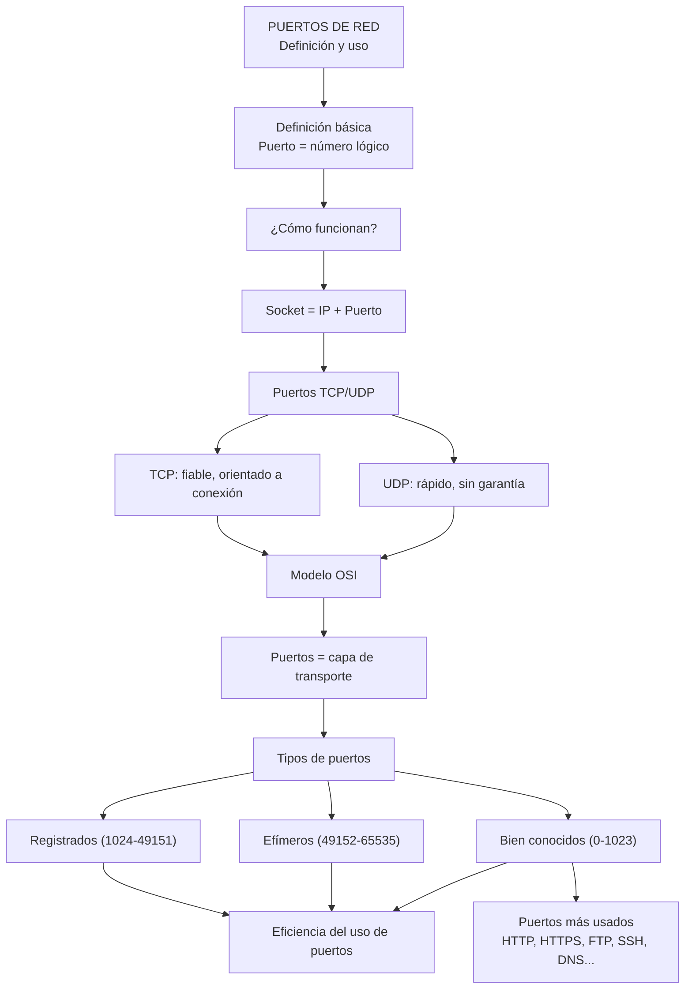
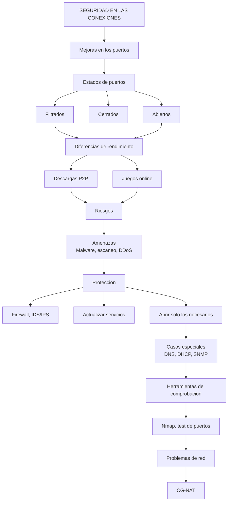
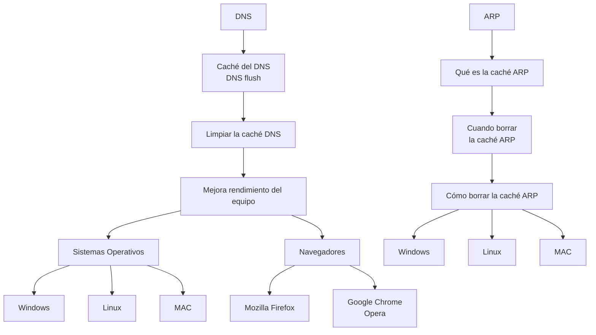

# PUERTOS DE RED

## Definición y uso

En el ámbito de las redes informáticas, los puertos de red representan un elemento esencial para la comunicación entre dispositivos y servicios en Internet. A través de ellos, los sistemas pueden identificar de forma precisa qué aplicación debe recibir o enviar información, permitiendo que múltiples procesos se ejecuten simultáneamente sobre una misma conexión.

!!! quote "Definición"
    **Un puerto es un punto virtual en el que comienzan y terminan las conexiones de red.** 

Los puertos están basados en software y los gestiona el sistema operativo de un ordenador. Cada puerto está asociado a un proceso o servicio específico. Los puertos permiten a los ordenadores diferenciar fácilmente los distintos tipos de tráfico: los correos electrónicos van a un puerto distinto de las páginas web, por ejemplo, aunque ambos lleguen a un ordenador a través de la misma conexión a Internet.

Este documento aborda de manera detallada el funcionamiento de los puertos TCP y UDP, explicando su papel dentro del modelo de comunicación en red, especialmente en la capa de transporte. Asimismo, se analizan las diferencias entre ambos protocolos, sus características principales y los contextos en los que se utilizan.

Además, se presentan los puertos más comunes y sus aplicaciones, junto con la clasificación de los mismos según su rango y función. También se estudian aspectos clave relacionados con la eficiencia, seguridad y gestión de los puertos, destacando la importancia de su correcta configuración para evitar vulnerabilidades y optimizar el rendimiento de la red.

## Contenidos
Esquema de los contenidos de las unidades

### PUERTOS

### SEGURIDAD EN LOS PUERTOS

### AMPLIACIÓN SOBRE DNS Y ARP
